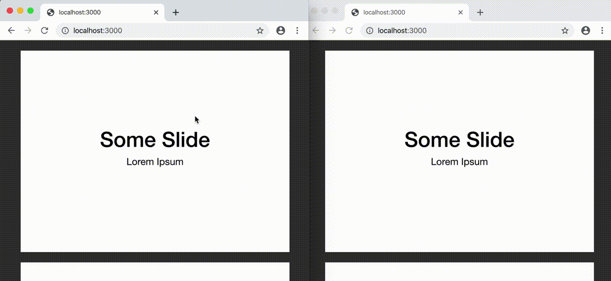

## SolidNotebook

*Because our notes ought to be on a solid footing.*

### Upcoming full release:

- Zig-based native app + a web version
- Rich Markdown editing
- Diagrams/slides: embedded in the Markdown documents or on their own
- Annotate anything with shapes / pencil strokes, including the Markdown text and its margins
- 100% P2P live collaboration
- 100% free / libre / open source, user-oriented, and analytics-free
- 100% deterministic build
- 100% open protocols, formats, and APIs for building upon

For code fragments in the Markdown:

- Jupyter and VSCode integration, replacing a subset of their frontends for latency and quality reasons
- Custom integrations via API

ETA: TBD

Want an email when it's released? Get in touch: andrew@member.fsf.org


### Published early: a small subset of the web version, as a diagram collaboration library




### Running the library's sample app

```
node examples/web-examples/server.js
```

From multiple browsers windows, visit http://localhost:3000/

Press `r` for Rectangle mode, `p` for pencil mode, and `z` to undo. The connection instance is made available as `window.conn` if you'd like to explore it.


### Using the library

```html
<script src="SolidNotebook-0.1.1.min.js" type="text/javascript"></script>
```

```js
const conn = new SN.Connection({
    containerId: 'my-container',
    containerSize: { width: 400, height: 460 },
    backgroundColor: '#333333',
    strokeWidth: 2,
    horizontalPadding: 40,
    verticalPadding: 20,
    diagramLoadingStateHTML: '...',
    connectionId: Math.random().toFixed(16).substr(2),
    diagrams: [
        { width: 800, height: 600, backgroundImage: '/slides/1.jpg' },
        { width: 800, height: 600, backgroundImage: '/slides/2.jpg' },
        { width: 800, height: 600, backgroundImage: '/slides/3.jpg' },
    ],

    // SN is transport-agnostic.
    // When it has a message to send, you handle that via this callback:
    onOutboundMessage: (message) => {
        myMessageBus.send(JSON.stringify(message));
    }
})

// When you get a message, tell SN
myMessageBus.on('message', (json) => {
    const message = JSON.parse(json);
    conn.handleInboundMessage(message);
})

conn.setMode('rectangle');    // 'rectangle', 'pencil', or null
conn.setColor('#FF0000');     // only this color format is supported
conn.setOpacity('0.3');
conn.setBroadcastScroll(false);
conn.setAllowScroll(false);
conn.getItems();
```
